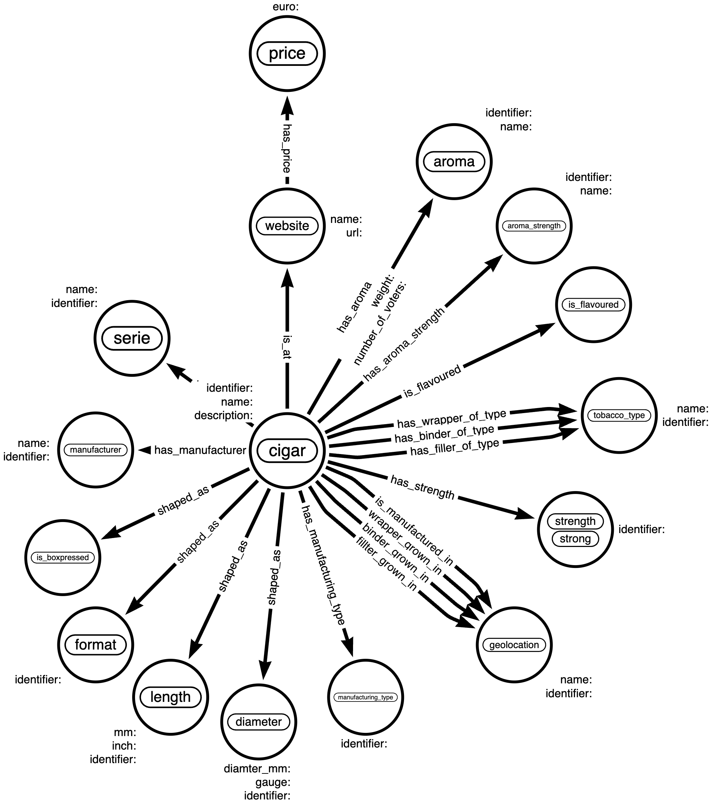

# Cigars Database

The repo contains the application to extract and persist the information describing cigars from various sources:

- nobelgo.de
- cigarworld.de

## Cigar attributes

| Category       | Attribute                | Comment                                                                                                              | Example                                                                                                                                                                                                                          |                                                    nobelgo.de                                                     |                                        cigarworld.de                                         |
|:---------------|:-------------------------|:---------------------------------------------------------------------------------------------------------------------|:---------------------------------------------------------------------------------------------------------------------------------------------------------------------------------------------------------------------------------|:-----------------------------------------------------------------------------------------------------------------:|:--------------------------------------------------------------------------------------------:|
| Identification | Name                     | Cigar name.                                                                                                          | No. 2                                                                                                                                                                                                                            |                                                         ✅                                                         |                                              ✅                                               |
| Identification | URL                      | Link to the data source.                                                                                             | https://www.cigarworld.de/en/zigarren/cuba/regulares/montecristo-no-2-01007_45                                                                                                                                                   |                                                         ✅                                                         |                                              ✅                                               |
| Identification | Brand                    | Manufacturer brand.                                                                                                  | Montecristo                                                                                                                                                                                                                      |                                                         ✅                                                         |                                              ✅                                               |
| Identification | Series                   | Cigar's series.                                                                                                      | -                                                                                                                                                                                                                                |                                                         ✅                                                         |                                              ✅                                               |
| Shape          | Format                   | The cigar's format.                                                                                                  | Pirámides                                                                                                                                                                                                                        |                                                         ✅                                                         |                                              ✅                                               |
| Shape          | Ring                     | The cigar's ring gauge in 64th of the inch.                                                                          | 52                                                                                                                                                                                                                               |                                                         ✅                                                         |                                              ✅                                               |
| Shape          | Diameter                 | The cigar's ring gauge in mm.                                                                                        | 20.6                                                                                                                                                                                                                             |                                                         ✅                                                         |                                              ✅                                               |
| Shape          | Length_in                | The cigar's length in inches.                                                                                        | 6.14                                                                                                                                                                                                                             |                                                         ✅                                                         |                                              ✅                                               |
| Shape          | Length_mm                | The cigar's length in mm.                                                                                            | 156                                                                                                                                                                                                                              |                                                         ✅                                                         |                                              ✅                                               |
| Manufacturing  | ManufactureOrigin        | The manufacturing country of origin.                                                                                 | Cuba                                                                                                                                                                                                                             |                                                         ✅                                                         |                                              ✅                                               |
| Manufacturing  | IsBoxpressed             | Indicates if cigar is manufactured using the box-press technology.                                                   | No                                                                                                                                                                                                                               |  ✅ potentially, it may be extracted from the details page: the selector `li.product-attribute-cig_form`   |                                              ✅                                               |
| Manufacturing  | TypeOfManufacturing      | How the cigar was manufactured. Find details [here](https://www.cigarworld.de/en/zigarrenlexikon/totalmente-a-mano). | TAM                                                                                                                                                                                                                              |                                                         ❌                                                         |                                              ✅                                               |
| Manufacturing  | Maker                    | Cigar maker, or blender who created the cigar.                                                                       | AJ Fernandez                                                                                                                                                                                                                     |                                                         ✅                                                         |                                              ❌                                               |
| Manufacturing  | Construction             | Cigar's construction type.                                                                                           | Longfiller                                                                                                                                                                                                                       |                                                         ✅                                                         |                                              ❌                                               |
| Manufacturing  | IsDiscontinued           | Indicates is the cigar is no longer in making.                                                                       | No                                                                                                                                                                                                                               |                                                         ❌                                                         | ✅  use the selector `div.text-danger` and search for the div text "Product discontinued" |
| Blend          | BinderOrigin             | The binder's countries of origin.                                                                                    | Cuba                                                                                                                                                                                                                             |                                                         ✅                                                         |                                              ✅                                               |
| Blend          | WrapperOrigin            | The wrapper's countries of origin.                                                                                   | Cuba                                                                                                                                                                                                                             |                                                         ✅                                                         |                                              ✅                                               |
| Blend          | FillerOrigin             | The wrapper's countries of origin.                                                                                   | Cuba                                                                                                                                                                                                                             |                                                         ✅                                                         |                                              ✅                                               |
| Blend          | IsFlavoured              | Indicates if cigar is flavoured.                                                                                     | No                                                                                                                                                                                                                               | ❌ potentially, it may be extracted from the details page: the selector `li.product-attribute-cig_special` |                                              ✅                                               |
| Blend          | AromaProfileManufacturer | Array of aroma flavours according to the data source / website.                                                      | Wood, Pepper                                                                                                                                                                                                                     |                                                         ✅                                                         |                                              ❌                                               |
| Blend          | AromaProfileCommunity    | Aroma flavours with their weights from 0 to 1 according to the community.                                            | { "Wood":0.12, "Pepper":0.06, "Grass":0.06, "Fruit":0.06, "Cream":0.1, "Sweet":0.08, "Nut":0.08, "Chocolate":0.08, "Coffee":0.12, "Toast":0.08, "Leather":0.06, "Soil":0.1 } |                                                         ❌                                                         |                                              ✅                                               |
| Blend          | WrapperType              | The wrapper leaf type.                                                                                               | Sun Grown                                                                                                                                                                                                                        |                                                         ✅                                                         |                                              ❌                                               |
| Blend          | AdditionalNotes          | Additional info.                                                                                                     | Barrel-aged leafs                                                                                                                                                                                                                |                                                         ✅                                                         |                                              ❌                                               |
| Experience     | SmokingDuration          | An estimation of the smoking duration in min.                                                                        | 84 min / 49 to 90 min                                                                                                                                                                                                            |                                                         ✅                                                         |                                              ✅                                               |
| Experience     | Strength                 | How strong the cigar is.                                                                                             | strong                                                                                                                                                                                                                           |                                                         ✅                                                         |                                              ❌                                               |
| Experience     | FlavourStrength          | How strong the cigar's aroma is.                                                                                     | strong                                                                                                                                                                                                                           |                                                         ✅                                                         |                                              ❌                                               |
| Purchase       | Price                    | Purchasing price in Euro per cigar.                                                                                  | 24.2                                                                                                                                                                                                                             |                                                         ✅                                                         |                                              ✅                                               |

## Knowledge graph data model

## TODO

- [] complete data extraction from cigargeeks.com
- [] extract data from www.cigarcentury.com:
  - Get the page https://www.cigarcentury.com/en/cigars?page=473.
  - Extract all cigars URL.
  - Get cigar profiles using extracted URLs.
  - Save.
